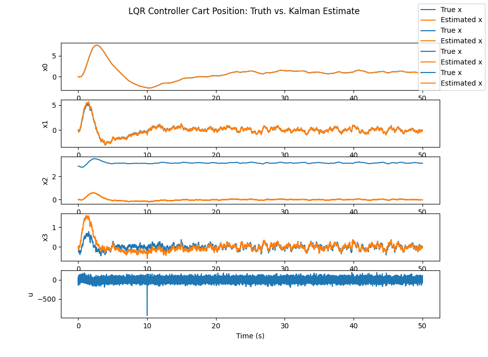
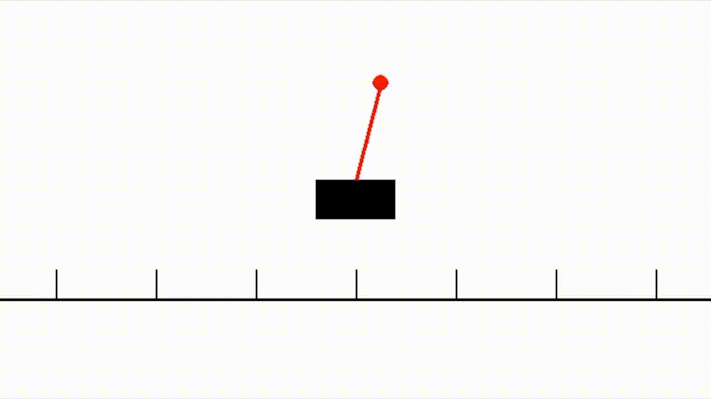

# README: LQR and LQE-Based Control of an Inverted Pendulum System

This project demonstrates the application of Linear Quadratic Regulator (LQR), Linear Quadratic Estimator (LQE), and the Separation Principle to control and estimate the states of an inverted pendulum system on a cart. The code also includes visualization tools to animate the system's dynamics and assess the control performance.

---

## **Control Concepts**

### **Linear Quadratic Regulator (LQR)**

LQR is a state-feedback control strategy that minimizes a quadratic cost function. The cost function balances the system's performance (e.g., deviation from the desired state) and control effort. In this project, the LQR computes an optimal gain matrix \( K \) based on the system's dynamics, penalizing deviations in state variables and control inputs.

### **Linear Quadratic Estimator (LQE)**

LQE, commonly referred to as the Kalman filter, estimates the system's states from noisy measurements. Using the system's dynamics and known noise characteristics, it produces the most likely state estimate, which is crucial for systems where some states are unobservable directly.

### **Separation Principle**

The separation principle ensures that the design of the LQR and LQE can be decoupled. The controller (LQR) uses the estimated states from the observer (LQE) as if they were the true states. This principle allows independent design and optimization of control and estimation strategies.

---

## **System Overview**

### **Inverted Pendulum Dynamics**

The inverted pendulum system is modeled using a nonlinear dynamic equation, linearized around the upright position for LQR and LQE design. The dynamics account for the cart's position, velocity, the pendulum's angle, and angular velocity.

### **Control Loop**

1. **State Estimation**: The LQE (Kalman filter) estimates the states from noisy measurements.
2. **State Feedback Control**: The LQR computes the control input based on the estimated states to stabilize the pendulum around the upright position.
3. **Disturbances and Noise**: The system simulates random disturbances and measurement noise to test robustness.

---

## **Code Layout**

1. **Dynamics Definition**:
   - `dynamics`: Defines the nonlinear system dynamics.
   - `get_state_matracies`: Provides linearized state-space matrices for control design.

2. **State Estimation**:
   - `kalmanDynamics`: Implements the Kalman filter dynamics.

3. **Simulation**:
   - `simulate_LQG`: Simulates the LQR and LQE loop, including the impact of disturbances and noise.
   - `simulate_estimation`: Simulates state estimation under predefined input forces.

4. **Visualization**:
   - `animate_cart_pendulum`: Creates an animation of the cart-pendulum system.
   - `cartpole.png`: A plot of convergence comparing true states and estimated states.
   - `cartpole.gif`: An animation showing the pendulum's dynamics under LQR control.

5. **Main Script**:
   - Designs the LQR and LQE gains.
   - Simulates and visualizes the system's performance.

---

## **Results**

1. **Convergence Plot**:
   - The `cartpole.png` illustrates the effectiveness of the LQR and LQE in stabilizing the system. True states converge to the desired values, and the Kalman filter's estimates closely match the true states.

2. **Animation**:
   - The `cartpole.gif` visually demonstrates the cart's smooth movement and the pendulum's stabilization under LQR control.


---

## **How to Run**

1. Install dependencies:

```bash
pip install numpy matplotlib pygame control moviepy
```

2. Run the main script:

```bash
python cartpole.py
```

3. The script will generate plots and an animation showing the control system in action.

---

## **Future Improvements**

- Extend the control to nonlinear dynamics directly (nonlinear model predictive control).
- Experiment with adaptive control strategies for varying parameters.
- Integrate real-time control on hardware platforms for validation.

---

This repository is a great resource for understanding LQR, LQE, and their application to dynamic systems, emphasizing the importance of optimal control and estimation in robotics and automation.
